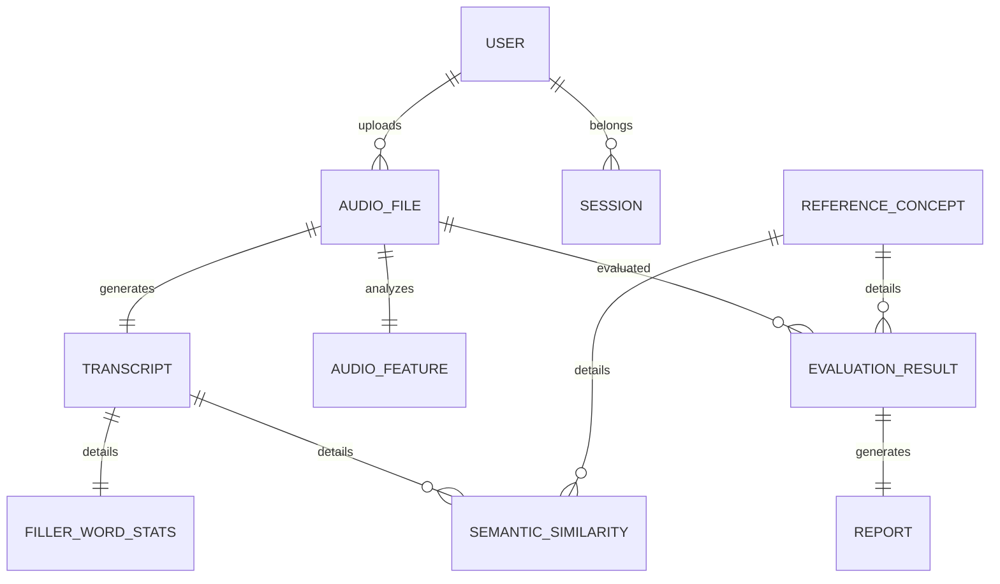

# Project Design Phase

## Entity Relationship Schema

The system uses a highly structured relational SQLite database structure comprising 10 distinct entities:

### Table Definitions
1. **user**: Unique emails, profiles, and roles.
2. **reference_concept**: Definitions used to match explanation.
3. **audio_file**: Holds path, file metadata, and duration.
4. **transcript**: Output of Whisper speech-to-text.
5. **audio_feature**: Silent pause ratio, ZCR, RMS energy.
6. **filler_word_stats**: Counts of 'um', 'uh', 'like' and word ratios.
7. **semantic_similarity**: Sentence-BERT cosine matches.
8. **evaluation_result**: Score (0-100), Tier level (Strong, Moderate, Poor), and detailed notes.
9. **report**: Generated PDF sizes and locations.
10. **session**: Active/ended session tracking.
